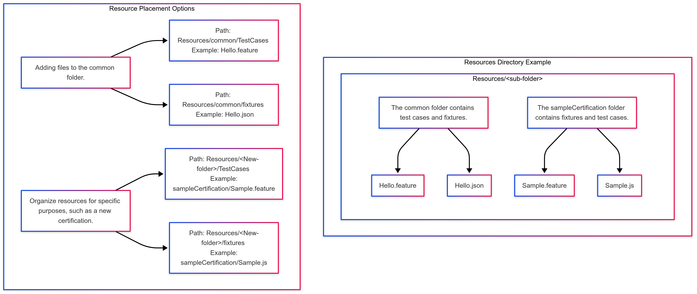

# resources
The `resources` folder in the Firebolt Certification Suite (FCS) contains all test cases and fixtures that are independent of any specific SDK version.

## Guidelines for Placing Files in resources
**Note**: In `Cypress` directory, the `TestCases` and `fixtures` folders exist but are typically empty. Files for these folders should be organized in the `resources` Directory as shown in the diagram below. Follow the diagram to understand where to place files for different purposes.



## Directory Structure
- **Initial Structure (after cloning):** When you first clone the repository, the `resources` directory will contain subfolders for TestCases and Fixtures.
  ```bash 
  resources
    ├── <subFolder>
    │   ├── fixtures      # SDK-independent fixture files
    │   ├── TestCases     # SDK-independent test case files
    ...
- **After Installing Dependencies:**  Once dependencies are installed (yarn install), the common test cases and fixtures from the configModule are copied into FCS’s `resources/external/` directory.
  ```bash 
  resources
    ├── <subFolder>
    │   ├── fixtures      # SDK-independent fixture files
    │   ├── TestCases     # SDK-independent test case files
    ├── external
    │   ├── <subFolder>
    │       ├── fixtures      # config module SDK-independent fixture files
    │       ├── TestCases     # config module SDK-independent test case files
    ...

## Test Execution
During test execution (e.g., using `cy:run` or `cy:open`), the script dynamically copies test cases and fixture files from the `resources` folder to their respective locations in the `cypress` directory.

## Copying Process
- Files in `fixtures` are copied to: `cypress/fixtures/`. And `TestCases` are copied to: `cypress/TestCases/`.

- Files in `resources/external/` are copied to: `cypress/fixtures/external/` and `cypress/TestCases/Distributor/`.

- Any additional folders inside `resources/` (e.g., `resources/external/<folderName>/`) are also copied to their respective subdirectories in `cypress/`.

## Extensibility for Certifications
If a new certification or resource type is introduced, we can group specific fixtures and test cases under a new folder within `resources`.

### Example:
To organize resources for a particular purpose, such as a new certification:

```bash
resources
├── <folderName>          # Folder for the specific certification or resource type (e.g., fireboltCertification)
│   ├── fixtures          # Certification-specific fixture files
│   ├── testCases         # Certification-specific test case files
```

## Note on File Overrides
During the copying process, if two files with the **same name** exist in different source directories, one file will override the other in the target location.

### Example:
When processing the `fixtures` directory, if both `resources/<subfolder1>/fixtures/data.json` and `resources/<subfolder2>/fixtures/data.json` exist, the second file (`resources/<subfolder2>/fixtures/data.json`) will override the first file in the target location (`cypress/fixtures/data.json`).

The console log will display a warning in **red** text to alert users:

```bash
File override warning: /cypress/fixtures/data.json will be overwritten by /resources/<subfolder2>/fixtures/data.json
```