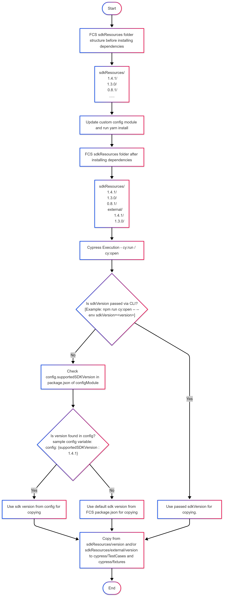
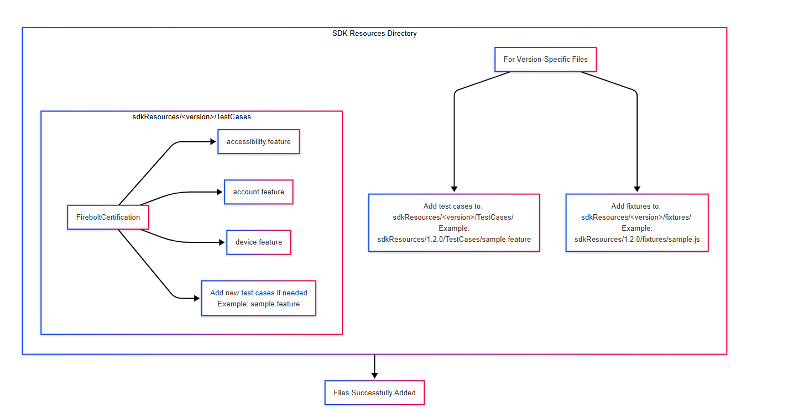

# sdkResources
The sdkResources directory in the Firebolt Certification Suite (FCS) contains version-specific test cases and fixtures for multiple SDK versions. These resources are organized in subfolders for each SDK version (e.g., /1.4.1, /1.3.0), and they are used during test execution.

## Flowchart of folder structure and resource copying process


## Directory Structure
- **Initial Structure (after cloning):** When you first clone the repository, the `sdkResources` directory will contain subfolders for each SDK version.
  ```bash 
  sdkResources
    ├── 1.4.1
    ├── 1.3.0
    ├── 0.8.1
    ...
- **After Installing Dependencies:**  Once dependencies are installed (yarn install), the test cases and fixtures for all SDK versions from the configModule are copied into FCS’s `sdkResources/external/` directory.
  ```bash
  sdkResources
    ├── 1.4.1
    ├── 1.3.0
    ├── 0.8.1
    ├── external
        ├── 1.4.1
        ├── 0.8.1  

## Guidelines for Placing Files in SDK Resources


## Test Execution
When you run tests using `cy:run or cy:open`, the script will dynamically copy the test case and fixture files from `sdkResources` to `cypress/fixtures` and `cypress/TestCases`.

### SDK Version Selection Flow
- **If an SDK version is passed in the CLI:**
The CLI argument `--env sdkVersion=<version>` takes priority. The corresponding version’s test cases and fixtures will be copied to `cypress/fixtures` and `cypress/TestCases.`

- **If no SDK version is passed in the CLI:**
The suite checks the package.json of the configModule (inside node_modules) for a config.supportedSDKVersion entry. If found, it will use the version specified, and the corresponding test cases and fixtures will be copied from:
    - `sdkResources/<version>` or
    - `sdkResources/external/<version>` (whichever is available).

- **If neither a CLI SDK version nor a supported version in the configModule is provided:** The suite defaults to using the `supportedSDKVersion` version defined in FCS’s `package.json` (currently 1.4.1), and the corresponding test cases and fixtures will be copied from: 
    - `sdkResources/<version>` or
    - `sdkResources/external/<version>` (whichever is available).

## Resource Copying Process
The corresponding test cases and fixtures are copied from the selected SDK version folder to the following locations in the `cypress/` folder:

- From `sdkResources/<version>`: 
    - Test cases are copied to `cypress/TestCases/`.
    - Fixtures are copied to `cypress/fixtures/.`
- From `sdkResources/external/<version>`:

    - Test cases are copied to `cypress/TestCases/Distributor/`.
    - Fixtures are copied to `cypress/fixtures/external/`.

Example of copied folder structure:

  ```bash
    FCS/
    ├── cypress/
    │   ├── fixtures/                  # Contains test fixtures (populated during execution)
    |   |    ├── external/             # Contains external test fixtures (populated during execution)
    │   └── TestCases/                 # Contains test cases (populated during execution)
    |   |    ├── Distributor/          # Contains external test cases (populated during execution)
    ├── sdkResources/                  # Contains versioned SDK resources (test cases & fixtures)
    │   ├── 1.4.1/                     # SDK resources for version 1.4.1
    │   ├── 1.3.0/                     # SDK resources for version 1.3.0
    │   ├── external/                  # External SDK resources (test cases & fixtures)
    │   │   ├── 1.4.1/                 # External resources for version 1.4.1
    │   │   └── 1.3.0/                 # External resources for version 1.3.0
    
```
## Important Guidelines
- The contents of the `cypress/fixtures` and `cypress/TestCases` directories **should not be edited** directly, as they will be **overwritten** and **deleted** each time tests are executed.
- These directories are repopulated dynamically based on the SDK version selected (either passed via CLI or defaulted in the configuration).
- You can edit files inside the `sdkResources` directory to update or modify test cases and fixtures for a specific SDK version. However, any changes made directly in the `cypress/fixtures` and `cypress/TestCases` folders will be lost during the next test execution.

## Example Flow
Here’s an example to illustrate the flow of resource copying:

- **Scenario 1:** You pass an SDK version in the CLI:

    Command: `cy:run --env sdkVersion=1.3.0`
    The test suite will use version 1.3.0. Resources will be copied from `sdkResources/1.3.0` and/or `sdkResources/external/1.3.0`  to cypress/ directories.
    
- **Scenario 2:** No SDK version is passed in the CLI, but a version is defined in the config:

    The config file (`configModule/package.json`) has a `config.supportedSDKVersion: 1.4.0.`
    The test suite will use version 1.4.0, copying resources from sdkResources/1.4.0 and/or sdkResources/external/1.4.0 to the appropriate cypress/ directories.

- **Scenario 3:** No version is passed via CLI, and no version is found in the config. 

    The suite will default to `supportedSDKVersion ` from the `FCS/package.json`, which is currently 1.4.1. Resources from `sdkResources/1.4.1` and/or sdkResources/external/1.4.1 will be copied to cypress/fixtures and cypress/TestCases.

**Note:** It will look for the version in both directories and copy whichever is available (either from the direct version folder or the external folder). If the version is found in both locations, it will copy resources from both.