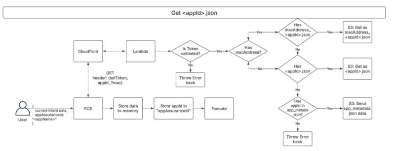

# App OnBoarding

## Overview:

This feature provides support for testing any newly onboarded app or existing app by adding the ability to execute single apps for App assurance test cases.
AppOnboarding has 2 types of feature files:

1. AppAssuranceLoggedIn:
   - This feature file has 3 types of scenarios
     - Quick start: Validates launch of a loggedIn app.
     - Dismiss: Validates dismissal of a loggedIn app. Dimiss scenarios supports the appLaunch intent, movie intent, series intent and song intent.
     - Deeplink: Validates launch of a loggedIn app on a particular page using different intents. Deeplink scenarios supports the movie intent, search intent, series intent and song intent.
2. AppAssuranceLoggedOut:
   - This feature file has 2 types of scenarios
     - Quick start: Validates launch of a loggedOut app.
     - Dismiss: Validates dismissal of a loggedOut app. Dimiss scenarios supports the appLaunch intent, movie intent, series intent.
     - Deeplink: Deeplink is not supported for loggedOut apps.

## Working flow:

An http call is made with below details to fetch the appMetaData from the s3 bucket.:

```
URL: https://devidbqi5h.execute-api.us-east-1.amazonaws.com/prod/getAppMetadata
Headers:
 x-firecert-sat:<SAT> (mandatory)
 x-firecert-mac:<mac> (optional) (Ex: 1A:2B:3C:4D:5E)
 x-firecert-product:sky (optional ...Default is set to sky)(Supported products are xsb and sky)
 x-firecert-appassuranceid:<appId> (mandatory) (Ex: apple.tv)
```

### FlowChart


S3 contains 3 types of json files:

1. &lt;deviceMac&gt;\_&lt;appId&gt;\_metadata.json: This file is first priority. This json file contains data of the specific appId and deviceMac.
2. &lt;appId&gt;\_metadata.json: This file is second priority. This json file contains the app metadata of the specific appId.
3. app_metadata.json: Acts as default file, if above files are not found this acts as default file. This json file contains the app metadata of all top18 appId's.

   ### App Metadata:

   ```
   {
    "defaultKeyPressSequence": {
        "dismiss": {
            "loggedIn": {
                "dismiss": [<key1>, <key2>, <key3>]
            },
            "loggedOut": {
                "dismiss": [<key1>, <key2>, <key3>]
            }
        },
        "playbackDismiss": {
            "loggedIn":{
                "dismiss": [<key1>, <key2>]
            },
            "loggedOut": {
                "dismiss": [<key1>, <key2>]
            }
        }
    },
    "<appId>": {
        "movie": {
            "entityId": "<entityId>"
        },
        "series": {
            "entityId": "<seriesId>"
        },
        "defaultKeyPressSequence" : {
            "loggedIn": {
                "dismiss": [<key1>, <key2>, <key3>]
            },
            "loggedOut": {
                "dismiss": [<key1>, <key2>, <key3>]
            }
        },
        "metadata": {
           "type": "<firebolt/badger/hybrid/native>"
        }
    },
   }
   ```

## Setup:

Currently, the AppOnboarding test cases are supported for 2 products, `xsb` and `sky`.<br>
If any new appId is being tested, please upload the respective file, it can be `<deviceMac>_<appId>_metadata.json` or `<appId>_metadata.json`, based on your requirement in s3 bucket (https://us-east-1.console.aws.amazon.com/s3/buckets/firecert-app-assurance?region=us-east-1&bucketType=general&tab=objects).

If any existing appId which is one of top18 apps is tested, that data should be already present in app_metadata.json file under respective product.

## Execution

### Run the certification suite with the browser

`npm run cy:open -- --env   satClientId=<satClientId>,satClientSecret=<satClientSecret>,testSuite=all,TAGS=not @notSupported,platformCommunication=Linchpin,firstPartyAppId=boltextn,deviceIp=localhost,enableScreenshots=true,deviceMac=<deviceMac>,testToken=<testToken>,appAssuranceId=<appId>`

### Run the certification suite in cli and get a report:

`npm run cy:run -- --spec "cypress/TestCases/Distributor/AppOnBoarding/<Feature file name>.feature" --env   satClientId=<satClientId>,satClientSecret=<satClientSecret>,testSuite=all,TAGS=not @notSupported,platformCommunication=Linchpin,firstPartyAppId=boltextn,deviceIp=localhost,enableScreenshots=true,deviceMac=<deviceMac>,testToken=<testToken>,appAssuranceId=<appId>`

### Configuration details

Need to pass the below values in the command line for AppOnboarding testing:

|Feild   | Type  | Description  | Mandatory  |
|--------|-------|--------------|------------|
|satClientSecret|String|Client Secret of the SAT.|Yes|
|satClientId|String|Client Id of the SAT.|Yes|
|appAssuranceId|String|AppId of an app which we want to test.|Yes|
|enableScreenshots|Boolean|Flag to enable/disable the screenshots and get the OCR validation results of the screenshot.|No|
|testToken|String|An authentication token to push the screenshot into s3 bucket and get a signed URL.|Yes|
|deviceMac|String|Mac address of the device.|Yes|
